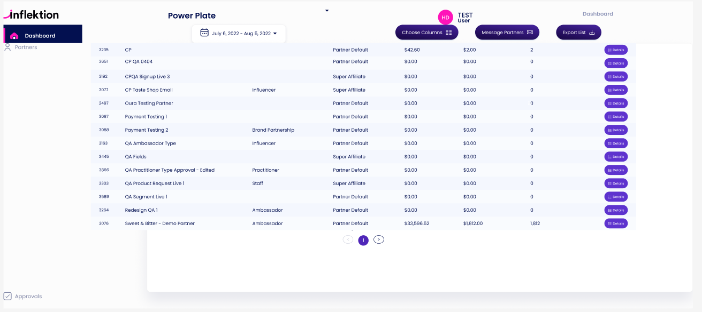

# InflectionPortal

This project was generated with [Angular CLI](https://github.com/angular/angular-cli) version 17.0.10.

## Development server

Run `ng serve` for a dev server. Navigate to `http://localhost:4200/`. The application will automatically reload if you change any of the source files.

## Code scaffolding

Run `ng generate component component-name` to generate a new component. You can also use `ng generate directive|pipe|service|class|guard|interface|enum|module`.

## Build

Run `ng build` to build the project. The build artifacts will be stored in the `dist/` directory.

## Running unit tests

Run `ng test` to execute the unit tests via [Karma](https://karma-runner.github.io).

## Running end-to-end tests

Run `ng e2e` to execute the end-to-end tests via a platform of your choice. To use this command, you need to first add a package that implements end-to-end testing capabilities.

## Further help

To get more help on the Angular CLI use `ng help` or go check out the [Angular CLI Overview and Command Reference](https://angular.io/cli) page.

# Partner Portal - Angular Frontend Assessment

## Overview

This project is a responsive single-page application (SPA) built with Angular. It displays partner data in a paginated table fetched from a mock API and is styled to match a given Figma design.

## Live Demo

[Live URL goes here]

## GitHub Repository

[Repository link goes here]

## Features

- Fetches partner data from a remote API
- Displays the data in a responsive, scrollable table
- Pagination (15 records per page)
- Placeholder buttons: "Message Partners", "Export List"
- Error handling and loading indicators
- Mobile-friendly layout

## Technologies Used

- Angular 18+
- SCSS
- antd design
- ngx-toastr
- TypeScript
- RxJS for async data handling

## Error Handling

- Displays user-friendly messages on API failure
- Defaults to `$0` if numeric fields like `commissions` or `grosssales` are `null`

