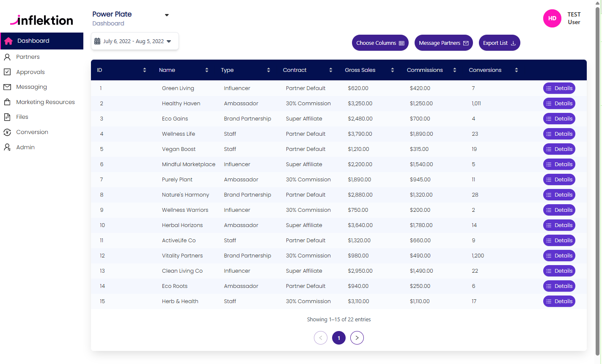

# InflectionPortal

This project was generated with [Angular CLI](https://github.com/angular/angular-cli) version 18.2.13.

## Development server
Run `npm install --force` to install dependencies The --force command is recommended because of conflicting dependencies of tailwindcss v4 and angular 18 

Run `ng serve` for a dev server. Navigate to `http://localhost:4200/`. The application will automatically reload if you change any of the source files.

## Code scaffolding

Run `ng generate component component-name` to generate a new component. You can also use `ng generate directive|pipe|service|class|guard|interface|enum|module`.

## Build

Run `ng build` to build the project. The build artifacts will be stored in the `dist/` directory.

## Running unit tests

Run `ng test` to execute the unit tests via [Karma](https://karma-runner.github.io).

## Running end-to-end tests

Run `ng e2e` to execute the end-to-end tests via a platform of your choice. To use this command, you need to first add a package that implements end-to-end testing capabilities.

## Further help

To get more help on the Angular CLI use `ng help` or go check out the [Angular CLI Overview and Command Reference](https://angular.io/cli) page.

# Partner Portal - Angular Frontend Assessment

## Overview

This project is a responsive single-page application (SPA) built with Angular. It displays partner data in a paginated table fetched from a mock API and is styled to match a given Figma design.

## Live Demo

https://bimeri.github.io/inflection-portal/

## GitHub Repository

https://github.com/bimeri/inflection-portal.git \
branch ``master``

 - to build app for GitHub deployment`ng b --output-path docs --base-href /inflection-portal/`
 - or better still run `ng build --base-ref /inflection-portal/` and then copy the build resource in the new folder `docs` in the root directory. that will be the folder to deploy to GitHub

## Features

- Fetches partner data from a remote API
- Displays the data in a responsive, scrollable table
- Pagination (15 records per page)
- Placeholder buttons: **Choose Columns**, **Message Partners** and **Export List**
- Error handling and loading indicators with *custom table skeleton loader*
- Mobile-friendly layout as seen in the screenshot below
- The application is internationalized with a translation pipe and a translation service
- The default language is the browser language, meaning the application takes the language set in the bowser by default to display text.
- For the moment, only English and French are set. if the browser language is different from any of these, it defaults to English
- Added animation on hovering on the left menu
- Implemented toast service to toast messages
- Added modal-to-display application export supported type 
- Application can export a PDF file. Downloading the table record as **PDF files**
- Other buttons just display some sweet animated alert message 
- Added angular routing to navigate between pages, fallback to the ***not-found*** page if the route is invalid
- I implemented the list of all partner pages and added other pages and route configuration, but I did not implement the pages because the design is not available
- using angular behavior subject to store and share content (store all the tale content gotten, so that the user cannot make another API call again once already on the page, except page refresh)

## Technologies Used

- Angular 18+
- tailwind SCSS
- antd design
- ngx-toaster service
- TypeScript
- RxJS for async data handling

## Error Handling
- I created a general error filtering logic to display the appropriate error based on the error type or error code
- Displays user-friendly messages on API failure
- Defaults to `$0` if numeric fields like `commissions` or `grosssales` are `null`

## Challenges faced
- I have some small difficulty in mobile responsiveness, especially with the table, but I resolved it succeeded by adding scroll on smaller devices
- I had issues with selecting the right icons since there are many libraries having similar icons
- I had to customize the library use in other to achieve the same output; an example pagination library did not have the same pagination payout as shown in the design, so I had to do manual styling
- I use the fore command to install dependency because I started the application with tailwind CSS version ^4.1.4, which is not compatible with angular 18. I could not revert the version because of insufficient time.

### final result

### view on small size

### view on mobile

